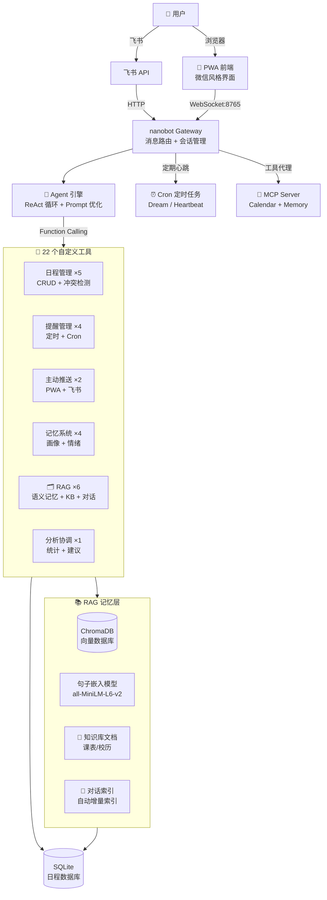

# 日程助手 - 基于 AI Agent 的个人日程管理助手

> 开源技术与应用 课程项目

[](https://python.org)
[](LICENSE)
[](https://github.com/HKUDS/nanobot)
[](https://deepseek.com)
[]()
[](https://nanoschedule-agent.onrender.com)

> 💡 **在线体验**：点击上方 Live Demo 徽章即可打开部署在 Render 上的日程助手，直接在网页端对话测试日程管理、提醒设置、知识库问答等功能。

## 项目简介

基于 [nanobot](https://github.com/HKUDS/nanobot)（HKUDS 开源 AI Agent 框架）二次开发，构建一个能够在移动端使用的 AI 日程管理助手。

**核心能力**：用户通过自然语言与 Agent 对话，Agent 自主调用 22 个工具完成日程管理、提醒推送、知识检索、语义记忆等操作。支持飞书和网页双通道，具备 RAG 记忆系统和主动推送引擎。

## 系统架构



## 架构设计

```
用户（手机浏览器 / PWA）
        ↓ HTTP + WebSocket
    Web 前端（PWA）
        ↓ WebSocket:8765
    nanobot Gateway（消息路由）
        ↓
    Agent 核心引擎（ReAct 循环 + Prompt 优化）
        ↓ Function Calling
    ┌──────────────────────────────────┐
    │  自定义工具 (22个)                 │
    │  ├─ 日程管理 (5): CRUD + 冲突检测  │
    │  ├─ 提醒管理 (4): 定时提醒 + Cron  │
    │  ├─ 主动推送 (2): PWA + 飞书推送   │
    │  ├─ 记忆系统 (7): 画像 + RAG + 情绪│
    │  ├─ 知识库 (3): 文档导入 + 问答    │
    │  └─ 分析协调 (1): 统计 + 建议      │
    └──────────┬───────────────────────┘
               ↓
    ┌──────────────────────────────────┐
    │  RAG 记忆层                        │
    │  ├─ ChromaDB 向量存储              │
    │  ├─ 语义记忆检索 (rag_memory)      │
    │  ├─ 知识库问答 (knowledge_base)    │
    │  └─ 对话历史索引 (conversation)    │
    └──────────┬───────────────────────┘
               ↓
    SQLite 数据库 + JSON 用户画像
```

## Agent 工作流程

```
用户: "明天下午3点开会，提前10分钟提醒我"
        ↓
Agent: Thought → 需要1)创建日程 2)设置提醒
        ↓
Action: create_event(title="开会", start_time="2026-06-25T15:00:00")
Observation: ✅ 日程已创建 (ID: 1)
        ↓
Action: setup_reminder(message="开会还有10分钟", remind_at="2026-06-25T14:50:00")
Observation: ✅ 提醒已设置 (ID: 1)
        ↓
Response: 已为你创建明天下午3点的会议，并设置14:50提醒
```

## 技术栈

| 层级 | 技术 | 说明 |
|------|------|------|
| Agent 框架 | nanobot v0.2.2 | HKUDS 开源个人 AI Agent |
| 大模型 | DeepSeek API | 兼容 OpenAI Function Calling |
| 后端语言 | Python 3.12 | 工具开发 + 服务 |
| 数据库 | SQLite | 日程和提醒存储 |
| 向量数据库 | ChromaDB | RAG 语义检索 |
| Embedding | sentence-transformers | all-MiniLM-L6-v2 本地模型 |
| 定时任务 | APScheduler | 提醒触发 + Cron |
| 前端 | PWA (HTML/JS) | 移动端安装到桌面 |
| 通信 | WebSocket + MCP | 实时推送 + 工具协议 |
| Prompt | Few-shot + 防重复 | 工具路由速查表 |

## 项目结构

```
开源技术与应用/
├── nanobot_calendar/          # 自定义工具包
│   ├── db.py                  # SQLite 数据库层
│   ├── calendar_tools.py      # 日程 CRUD 工具 (5个)
│   ├── reminder_tools.py      # 提醒管理工具 (4个)
│   ├── proactive.py           # 主动推送引擎 (FriendBrain)
│   ├── proactive_tools.py     # 主动推送开关工具
│   ├── memory_engine.py       # 用户画像 + 偏好学习
│   ├── memory_tools.py        # 记忆工具 (4个)
│   ├── rag_memory.py          # RAG 语义记忆 (ChromaDB)
│   ├── rag_tools.py           # RAG 检索工具 (3个)
│   ├── knowledge_base.py      # 知识库引擎 (文档问答)
│   ├── conversation_indexer.py # 对话历史自动索引
│   ├── kb_tools.py            # KB + 对话搜索工具 (3个)
│   ├── advisor.py             # 日程分析引擎
│   ├── coordinator.py         # 多 Agent 协调
│   └── stats_api.py           # 统计数据 API
├── mcp_servers/               # MCP 协议服务
│   ├── calendar_mcp.py        # 日程 MCP Server
│   └── memory_mcp.py          # 记忆 MCP Server
├── webui/                     # PWA 前端
│   ├── index.html             # 微信风格聊天界面
│   ├── manifest.json          # PWA 配置
│   └── sw.js                  # Service Worker
├── workspace/                 # nanobot 工作区
│   ├── SOUL.md               # Agent 人格 + Few-shot
│   ├── AGENTS.md             # Agent 工作流
│   └── USER.md               # 用户画像
├── knowledge/                 # 知识库文档 (自动导入)
├── serve_pwa.py              # PWA 服务器 + RAG 初始化
├── start.bat                 # 一键启动 (自动杀旧进程)
├── start_keepalive.bat       # 保活模式 (崩溃自动重启)
├── setup.py / pyproject.toml # 包配置 (22 工具注册)
└── README.md
```

## 快速开始

### 1. 环境要求

- Python 3.11+
- DeepSeek API Key（[platform.deepseek.com](https://platform.deepseek.com) 注册获取）

### 2. 安装

```bash
# 创建虚拟环境
python -m venv venv
venv\Scripts\activate  # Windows
source venv/bin/activate  # Mac/Linux

# 安装 nanobot
pip install nanobot-ai

# 安装自定义工具包
pip install -e .

# 配置 API Key
# 编辑 ~/.nanobot/config.json，将 deepseek.api_key 设为你的真实 Key
```

### 3. 初始化数据库

```bash
python -c "from nanobot_calendar import db; db.init_db()"
```

### 4. 启动服务

```bash
# 终端1：启动 nanobot Gateway（WebSocket 服务）
nanobot gateway

# 终端2：启动 PWA 前端服务器
python serve_pwa.py
```

### 5. 访问

- **手机浏览器**: `http://<电脑IP>:3000`
- **添加到桌面**: 浏览器菜单 → 添加到主屏幕

### 6. 飞书机器人连接（可选）

本应用支持通过飞书接收提醒和与 Agent 对话。

**step 1**：在[飞书开放平台](https://open.feishu.cn/)创建企业自建应用。

**step 2**：获取 App ID 和 App Secret，编辑 `~/.nanobot/config.json`：

```json
{
  "channels": {
    "feishu": {
      "enabled": true,
      "appId": "你的 App ID",
      "appSecret": "你的 App Secret",
      "domain": "feishu"
    }
  }
}
```

**step 3**：在飞书开放平台配置事件订阅：
- 请求网址: `http://<你的公网IP>:18790/feishu/event`
- 添加"消息与群组"相关权限

**step 4**：重启 Gateway 即可在飞书与 Agent 对话，定时提醒也会推送到飞书。

> 💡 飞书和网页端数据互通，在飞书创建的日程和提醒，网页端同样可见。

### 7. 在线部署（Render）

项目已配置 Docker 一键部署，无需服务器。

**step 1**：Fork 本仓库，注册 [Render](https://render.com)（GitHub 登录）

**step 2**：New Web Service → 选择仓库 → 自动识别 Dockerfile

**step 3**：添加环境变量 `DEEPSEEK_API_KEY` = 你的 API Key

**step 4**：点击部署，3 分钟后访问 `https://你的应用名.onrender.com`

部署后把链接填入 README 顶部的 Live Demo 徽章即可。

## 演示示例

```bash
# 命令行模式
nanobot agent -m "明天下午3点开会，地点A101，提前10分钟提醒我"
nanobot agent -m "我这周有什么安排"
nanobot agent -m "把上次那个会议改到周四下午4点"
nanobot agent -m "取消ID为3的提醒"
```

## 核心功能

| 功能模块 | 说明 |
|---------|------|
| 🗓️ 日程管理 | 自然语言创建/查询/修改/删除，自动冲突检测 |
| ⏰ 智能提醒 | 定时提醒 + 15分钟前自动推送 (PWA + 飞书) |
| 💬 主动聊天 | FriendBrain 引擎，空闲时主动闲聊，早晚问候 |
| 🧠 RAG 记忆 | ChromaDB 向量检索，语义匹配而非关键词 |
| 📚 知识库问答 | 导入课表/校历，Agent 回答"周三有课吗" |
| 💾 对话历史 | 自动索引历史对话，支持"上次聊的XX"搜索 |
| 🎯 Prompt 优化 | Few-shot 示例 + 工具路由速查表 + 防重复机制 |
| 👤 用户画像 | 自动学习偏好/习惯，关系等级影响对话语气 |
| 📱 双通道 | 飞书 + PWA 网页，数据互通 |
| 🔄 保活监控 | 崩溃自动重启，30秒检测间隔 |

## 创新点

1. **基于成熟开源项目二次开发** — 体现了"开源技术应用"课程主题
2. **RAG 语义记忆系统** — ChromaDB 向量检索替代关键词查找，不同问法也能命中
3. **完整的 Agent 决策循环** — ReAct 模式：感知→规划→执行→反馈
4. **Prompt 工程实践** — Few-shot 示例、工具路由表、防重复机制
5. **知识库 + 对话索引** — 文档自动分块导入，对话自动增量索引
6. **多工具协同调用** — 22 个工具，Agent 自动选择合适的组合
7. **移动端 PWA** — 手机浏览器打开，可安装到桌面
8. **实用价值高** — 可作为日常使用的个人 AI 助理

## 与 nanobot (HKUDS) 的关系

本项目基于 nanobot 的 Agent 框架进行二次开发：
- 保留了 nanobot 的 Agent 循环、多通道、记忆系统
- 新增了 22 个自定义工具（日程、提醒、RAG、KB、分析）
- 集成了 ChromaDB 向量数据库实现 RAG 语义检索
- 定制了 Agent 行为配置（SOUL.md，含 Few-shot 示例）
- 添加了 PWA 移动端界面和保活监控脚本

## 许可证

MIT
